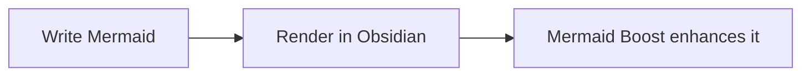

# Mermaid Boost (`mermaid-boost`)

[简体中文](README.zh-CN.md) | English

Mermaid Boost is an Obsidian plugin that makes rendered Mermaid diagrams easier to read, navigate, and export. It adds smart compact sizing, **7 theme groups with 29 themes**, interactive zoom controls, fullscreen pan/zoom, and HD PNG export while keeping standard Mermaid code blocks as the source.

- Current version: **1.0.1**
- Minimum Obsidian version: **1.5.0**
- Desktop-only: **No**

## Features

### Smart diagram sizing

Mermaid Boost can scale large diagrams into a practical reading area without shrinking them below a configured readability floor. Four presets are built in:

| Preset | Base scale | Max width | Max height | Minimum readable scale |
| --- | ---: | ---: | ---: | ---: |
| Compact | 72% | 620 px | 320 px | 52% |
| Balanced | 85% | 740 px | 440 px | 58% |
| Relaxed | 100% | 900 px | 580 px | 65% |
| Original | 100% | 1600 px | 2400 px | 100% |

Tall diagrams can be collapsed automatically instead of being reduced to an unreadable size.

### Interactive controls

Enhanced diagrams expose controls for common viewing actions:

- **Zoom out / reset / zoom in** directly from the diagram toolbar.
- A scale badge shows the current display scale.
- **Double-click fullscreen** opens an interactive lightbox for pan and zoom.
- **HD PNG export** lets you copy/export a high-resolution raster image of the diagram.
- Zoom sensitivity can be adjusted from the plugin settings.

### 29 themes in 7 groups

Themes restyle the diagram canvas, nodes, clusters, notes, edges, labels, fonts, corner radius, and selected decorative effects.

#### 1. Styled (4)

- **`claude` — Claude:** cream canvas, clay accent, serif typography.
- **`notion` — Notion:** clean white and soft-grey palette.
- **`notion-dark` — Notion dark:** charcoal background with light text.
- **`handcrafted` — Handcrafted:** paper/marker look with rounded nodes and wobbly lines.

#### 2. Developer (4)

- **`nord` — Nord:** icy blue-grey developer palette.
- **`dracula` — Dracula:** dark purple with pink accents.
- **`solarized` — Solarized:** warm beige with teal/blue accents.
- **`gruvbox` — Gruvbox:** earthy retro dark palette.

#### 3. Paper & print (4)

- **`blueprint` — Blueprint:** technical white-on-blue styling with a grid background.
- **`newspaper` — Newspaper:** ink-on-newsprint appearance.
- **`academic` — Academic:** restrained greyscale styling suitable for papers and reports.
- **`kraft-paper` — Kraft paper:** brown paper stock with stamped-print character.

#### 4. Retro & playful (5)

- **`chalkboard` — Chalkboard:** chalk-on-green styling with a hand-drawn effect.
- **`terminal-crt` — Terminal / CRT:** phosphor-green terminal look with glow.
- **`game-boy` — Game Boy:** four-green retro handheld palette.
- **`synthwave` — Synthwave:** neon pink/purple styling with glow.
- **`sticky-notes` — Sticky notes:** cork-board feel with colorful sticky-note nodes.

#### 5. Brand-inspired (5)

- **`github-light` — GitHub light:** white/grey palette with green accents.
- **`github-dark` — GitHub dark:** dimmed dark GitHub-inspired palette.
- **`linear` — Linear:** near-black interface with violet accents/glow.
- **`stripe` — Stripe:** clean white and indigo styling.
- **`metro-map` — Metro map:** bold station nodes and transit-style colored routes.

#### 6. Functional (3)

- **`high-contrast` — High contrast:** black-and-white palette with thicker strokes.
- **`colorblind-safe` — Colorblind-safe:** Okabe-Ito-inspired multi-color palette.
- **`mono-accent` — Mono + one accent:** greyscale base with an orange key-path accent.

#### 7. Built-in (4)

- **`builtin-default` — default**
- **`builtin-neutral` — neutral**
- **`builtin-dark` — dark**
- **`builtin-forest` — forest**

## Settings

Mermaid Boost exposes its behavior in **Obsidian Settings → Mermaid Boost**.

| Setting | Default | Purpose |
| --- | --- | --- |
| Size preset | `compact` | Selects the Compact, Balanced, Relaxed, or Original sizing profile. |
| Base scale | `0.72` | Default diagram scale before size constraints are applied. |
| Max height | `320 px` | Maximum preferred diagram height before scaling/collapsing logic applies. |
| Max width | `620 px` | Maximum preferred diagram width before scaling logic applies. |
| Min readable scale | `0.52` | Prevents very large diagrams from being reduced below a readable scale. |
| Theme | `claude` | Chooses one of the 29 bundled themes. |
| Node radius | `12` | Controls node corner rounding. |
| Multi-tone nodes | Off | Enables multiple node tones where supported by the selected theme. |
| Trim pie padding | On | Reduces unnecessary padding around Mermaid pie charts. |
| Card frame | On | Shows the styled card/container around a diagram. |
| Dot grid | Off | Adds the optional diagram-card dot grid. |
| Header bar | On | Shows the diagram header/toolbar area. |
| Auto-collapse tall diagrams | On | Collapses diagrams that would otherwise become excessively tall. |
| Double-click fullscreen | On | Opens the pan/zoom lightbox when a diagram is double-clicked. |
| Zoom sensitivity | `1.0` | Adjusts interactive zoom behavior. |

Changing a size preset provides a sensible group of sizing values; advanced users can then tune individual values as needed.

## Usage

Use ordinary Mermaid fenced code blocks in your notes:

````markdown

````

After Mermaid renders the SVG, Mermaid Boost applies the selected sizing, theme, card styling, and interactive controls. Your Mermaid source remains normal Markdown.

## Installation

### Manual installation

1. Create the plugin directory:

   ```text
   <Vault>/.obsidian/plugins/mermaid-boost/
   ```

2. Copy these files from the repository into that directory:

   - `manifest.json`
   - `main.js`
   - `styles.css`

3. Reload Obsidian.
4. Open **Settings → Community plugins**.
5. Enable **Mermaid Boost**.

> The plugin manifest currently requires Obsidian **1.5.0 or newer** and does not mark the plugin as desktop-only.

## Compatibility notes

- Mermaid Boost enhances Mermaid diagrams after Obsidian renders them; it does not require a custom Mermaid syntax.
- Theme styling covers common Mermaid SVG elements such as nodes, clusters, notes, edges, labels, and pie-chart colors. Exact output can still vary with diagram type and the Mermaid version bundled by Obsidian.
- Very large diagrams are intentionally constrained by the active sizing profile. Use **Original** when you want a near-unconstrained 1:1 presentation.

## Development

The repository ships the runtime JavaScript directly and has no required build step for normal development checks.

Requirements used by CI:

- Node.js **22**

Run the test suite:

```bash
npm test
```

Useful syntax checks:

```bash
node --check main.js
node --check lib.js
node --check lib.test.js
```

The CI workflow runs JavaScript syntax checks, the existing Node test suite, and basic Obsidian manifest/package validation on pull requests and pushes to `main`.

## Repository structure

| Path | Purpose |
| --- | --- |
| `main.js` | Obsidian plugin runtime, UI controls, settings, and diagram enhancement behavior. |
| `lib.js` | Core sizing, theme palettes, and SVG beautification logic. |
| `lib.test.js` | Node-based tests for the shared logic. |
| `styles.css` | Diagram card, toolbar, lightbox, and theme-related CSS. |
| `manifest.json` | Obsidian plugin metadata. |
| `data.json` | Example/current plugin settings data in the repository. |
| `.github/workflows/ci.yml` | Core CI checks. |
| `.coderabbit.yaml` | CodeRabbit review configuration. |

## Contributing

Issues and pull requests are welcome. For behavior changes, please keep the documentation and tests aligned with the implementation, and verify that existing Mermaid rendering, sizing, and interaction behavior is not regressed.

## License

The package metadata declares this project under the **MIT** license.
