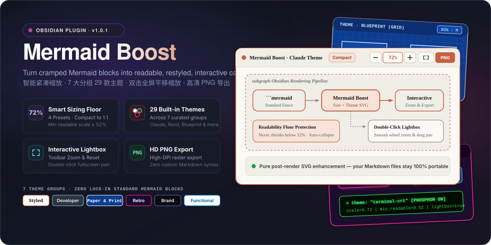
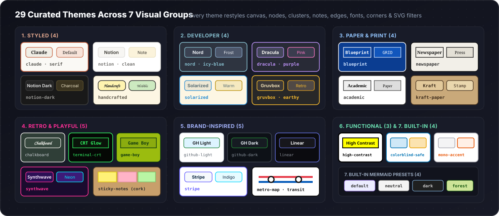
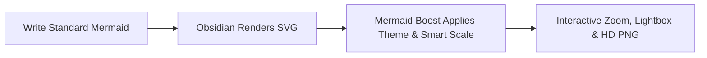

# Mermaid Boost

<div align="center">



<br />

[](https://github.com/dreamfarer-space/obsidian-mermaid-boost/releases/tag/1.0.2)
[](https://obsidian.md)
[](#29-themes-across-7-groups)
[](https://github.com/dreamfarer-space/obsidian-mermaid-boost/actions/workflows/ci.yml)
[](#contributing--license)

**English** · **[简体中文](README.zh-CN.md)**

[Why Mermaid Boost?](#why-mermaid-boost) · [Features](#features) · [29 Themes](#29-themes-across-7-groups) · [Quick Start](#quick-start--installation) · [Settings](#settings-reference) · [Development](#development)

</div>

---

## Why Mermaid Boost?

Mermaid diagrams in Obsidian often suffer from two extremes: sprawling architecture charts either **overflow the reading column** or **shrink to microscopic, unreadable text**.

**Mermaid Boost** enhances Obsidian's rendered Mermaid SVGs on the fly—adding a **readability floor**, **29 handcrafted themes**, **inline zoom controls**, a **double-click pan/zoom lightbox**, and **one-click HD PNG export**—while keeping your note source 100% standard ` ```mermaid ` Markdown.

| Capability | Default Obsidian Mermaid | With **Mermaid Boost** |
| :--- | :--- | :--- |
| **Large Diagram Sizing** | Shrinks unconstrained or overflows container | **4 Smart Presets (`S` / `M` / `L` / `1:1`)** with a strict **Minimum Readable Scale** floor |
| **Tall Flowcharts** | Pushes note content several screens down | **Auto-collapses tall diagrams** cleanly instead of crushing text size |
| **Visual Styling** | Basic default Mermaid skin | **29 curated themes across 7 groups** (canvas, nodes, clusters, edges, fonts & SVG filters) |
| **Navigation & Inspection** | Static inline SVG | **Toolbar Zoom (`−` / `72%` / `+`)** + **Double-click Fullscreen Lightbox** with smooth drag-pan |
| **Sharing & Export** | Manual screenshot at screen DPI | **One-click HD PNG Export** directly from the diagram header |
| **Markdown Lock-in** | Standard ` ```mermaid ` fence | **100% Standard ` ```mermaid ` fence** — zero proprietary syntax |

---

## Features

### 1. Smart Diagram Sizing with Readability Floor

Mermaid Boost scales diagrams to fit a comfortable reading area while enforcing a **Minimum Readable Scale** floor so labels never become illegible. Tall diagrams can automatically collapse with an expand toggle rather than shrinking into a thin vertical strip.

| Preset | Short | Base Scale | Max Width | Max Height | Min Readable Scale | Best For |
| :--- | :---: | ---: | ---: | ---: | ---: | :--- |
| **Compact** *(default)* | `S` | `72%` | `620 px` | `320 px` | **`52%`** | Dense study notes & side-by-side panes |
| **Balanced** | `M` | `85%` | `740 px` | `440 px` | **`58%`** | Everyday technical documentation |
| **Relaxed** | `L` | `100%` | `900 px` | `580 px` | **`65%`** | Wide monitors & architecture reviews |
| **Original** | `1:1` | `100%` | `1600 px` | `2400 px` | **`100%`** | Full 1:1 unconstrained presentation |

### 2. Interactive Controls & Fullscreen Lightbox

Every enhanced diagram card exposes quick controls in its header toolbar:

- **Inline Zoom (`−` / `72%` / `+`)** — Adjust diagram scale on the spot or click the percentage badge to reset.
- **Double-Click Fullscreen Lightbox** — Open any diagram in an interactive overlay with mouse-wheel zoom and click-drag panning.
- **One-Click HD PNG Export** — Copy or export crisp, high-resolution raster images ready for slides, papers, or chat.
- **Customizable Frame & Grid** — Toggle the card frame, subtle dot-grid background, header bar, node corner radius, and pie-chart padding trim.

---

## 29 Themes Across 7 Groups

<div align="center">
  
</div>

<br />

Themes restyle the entire SVG hierarchy—**canvas background, primary/secondary nodes, subgraph clusters, notes, edge paths, edge labels, typography, corner radius, and decorative SVG filters** (hand-drawn wobble, neon/CRT glow, blueprint grids, and corkboard textures).

| Group | Theme ID | Display Name | Palette & Typography | Signature Visual Character |
| :--- | :--- | :--- | :--- | :--- |
| **1. Styled** *(4)* | `claude` *(default)* | **Claude** | Cream `#faf9f5` · Clay `#c6613f` · Serif | Warm editorial card with rounded nodes & terracotta accents |
| | `notion` | **Notion** | Pure White `#ffffff` · Soft Grey `#f7f6f3` · Sans | Clean, understated workspace aesthetic with warm yellow notes |
| | `notion-dark` | **Notion dark** | Charcoal `#191919` · Slate `#252525` · Sans | Low-glare dark mode workspace styling |
| | `handcrafted` | **Handcrafted** | Warm Paper `#fdf6e3` · Marker `#fff3b0` · Hand | Sketchbook feel with hand-drawn SVG wobble filter |
| **2. Developer** *(4)* | `nord` | **Nord** | Polar Night `#2e3440` · Frost `#88c0d0` · Sans | Arctic blue-grey developer palette |
| | `dracula` | **Dracula** | Dark Slate `#282a36` · Purple `#bd93f9` · Pink `#ff79c6` | High-contrast vampire dark theme with neon pink edges |
| | `solarized` | **Solarized** | Cream `#fdf6e3` · Teal Blue `#268bd2` · Sans | Ethan Schoonover's precision warm light palette |
| | `gruvbox` | **Gruvbox** | Retro Dark `#282828` · Amber `#fabd2f` · Sans | Warm earthy retro terminal palette |
| **3. Paper & Print** *(4)* | `blueprint` | **Blueprint** | Technical Blue `#0b3d91` · Crisp White `#ffffff` · Mono | Drafting table aesthetic with 20px coordinate grid |
| | `newspaper` | **Newspaper** | Newsprint `#f2efe8` · Press Ink `#111111` · Serif | High-contrast editorial print typography |
| | `academic` | **Academic** | Pure White `#ffffff` · Greyscale `#333333` · Serif | Computer Modern / Times styling tailored for papers & theses |
| | `kraft-paper` | **Kraft paper** | Brown Stock `#c9a97a` · Espresso `#4a3520` · Mono | Stamped parcel paper look with warm kraft tones |
| **4. Retro & Playful** *(5)* | `chalkboard` | **Chalkboard** | Slate Green `#2f3e37` · Chalk `#f5f5f0` · Hand | Classroom chalkboard with wobbly hand-drawn lines |
| | `terminal-crt` | **Terminal / CRT** | Phosphor Black `#050805` · Green `#33ff66` · Mono | Retro green CRT monitor with phosphor glow filter |
| | `game-boy` | **Game Boy** | DMG Olive `#9bbc0f` · Deep Green `#0f380f` · Mono | Classic 4-shade handheld LCD palette |
| | `synthwave` | **Synthwave** | Midnight `#1a0b2e` · Neon Pink `#ff2e97` · Cyan `#00f0ff` | Outrun 80s neon glow with cyan laser connectors |
| | `sticky-notes` | **Sticky notes** | Corkboard `#c89f6b` · Multi-color Post-its · Hand | Radial cork texture with cycling yellow, pink & mint notes |
| **5. Brand-Inspired** *(5)* | `github-light` | **GitHub light** | White `#ffffff` · Neutral `#f6f8fa` · Green `#1a7f37` | Familiar GitHub Primer light documentation look |
| | `github-dark` | **GitHub dark** | Dimmed `#0d1117` · Canvas `#161b22` · Green `#238636` | GitHub Primer dark mode palette |
| | `linear` | **Linear** | Obsidian `#0b0b0f` · Indigo `#5e6ad2` · Sans | Near-black precision interface with subtle violet glow |
| | `stripe` | **Stripe** | Crisp White `#ffffff` · Blurple `#635bff` · Cyan `#00d4ff` | FinTech product documentation styling |
| | `metro-map` | **Metro map** | White `#ffffff` · Bold Station `#111111` · Transit Lines | Thick 6px cycling red/blue/green transit routes & station nodes |
| **6. Functional** *(3)* | `high-contrast` | **High contrast** | White `#ffffff` · Pure Black `#000000` · Yellow `#ffff00` | 3px heavy borders & maximum legibility |
| | `colorblind-safe` | **Colorblind-safe** | White `#ffffff` · Okabe-Ito 6-color cycle | Scientifically distinguishable multi-category node palette |
| | `mono-accent` | **Mono + one accent** | Zinc Grey `#f4f4f5` · Signal Orange `#e8590c` | Muted greyscale baseline that spotlights key nodes in orange |
| **7. Built-in** *(4)* | `builtin-default` | **default** | Classic Lavender `#ECECFF` · Border `#9370DB` | Standard Mermaid default palette with Boost sizing & controls |
| | `builtin-neutral` | **neutral** | Neutral Grey `#f4f4f4` · Border `#666666` | Standard Mermaid neutral monochrome palette |
| | `builtin-dark` | **dark** | Dark Charcoal `#1f2020` · Steel `#81B1DB` | Standard Mermaid dark palette |
| | `builtin-forest` | **forest** | Forest Mint `#cde498` · Pine `#13540c` | Standard Mermaid forest green palette |

---

## Quick Start & Installation

### Option 1: Install via GitHub Release / BRAT

- **From [GitHub Releases (`v1.0.2`)](https://github.com/dreamfarer-space/obsidian-mermaid-boost/releases/tag/1.0.2)**: Download `mermaid-boost-1.0.2.zip` and extract its files into `<Vault>/.obsidian/plugins/mermaid-boost/`, or download `manifest.json`, `main.js`, and `styles.css` individually and copy them into that folder.
- **Via [Obsidian BRAT](https://github.com/TfTHacker/obsidian42-brat)**: Add beta plugin repository `dreamfarer-space/obsidian-mermaid-boost` and enable **Mermaid Boost**.

### Option 2: Manual Installation

1. Create the plugin folder inside your Obsidian vault:
   ```text
   <Vault>/.obsidian/plugins/mermaid-boost/
   ```
2. Copy these three runtime files from the repository into that folder:
   - `manifest.json`
   - `main.js`
   - `styles.css`
3. Reload Obsidian (`Ctrl/Cmd + R`).
4. Navigate to **Settings → Community plugins** and enable **Mermaid Boost**.

> [!NOTE]
> Requires **Obsidian 1.5.0+**. Works across both desktop and mobile (`isDesktopOnly: false`).

### Usage

Write standard Mermaid fenced code blocks in any note—no custom codeblock syntax needed:

````markdown

````

---

## Settings Reference

Configure all options under **Obsidian Settings → Mermaid Boost**:

| Category | Setting | Default | Description |
| :--- | :--- | :---: | :--- |
| **Sizing** | **Size preset** | `compact` | Choose `compact` (`S`), `balanced` (`M`), `relaxed` (`L`), or `original` (`1:1`). |
| | **Base scale** | `0.72` | Initial display scale before container constraints are evaluated. |
| | **Max width** | `620 px` | Target maximum width before proportional downscaling kicks in. |
| | **Max height** | `320 px` | Target maximum height before scaling or auto-collapse applies. |
| | **Min readable scale** | `0.52` | Hard readability floor preventing huge diagrams from shrinking too far. |
| | **Auto-collapse tall diagrams** | `On` | Collapses overly tall diagrams behind an expand toggle. |
| **Appearance** | **Theme** | `claude` | Select any of the 29 themes across 7 groups. |
| | **Node radius** | `12` | Corner rounding radius applied to diagram nodes. |
| | **Multi-tone nodes** | `Off` | Cycles secondary/accent tones across nodes when supported by the theme. |
| | **Trim pie padding** | `On` | Strips excessive whitespace around Mermaid `pie` charts. |
| **Card & UI** | **Card frame** | `On` | Wraps rendered diagrams in a themed card container. |
| | **Dot grid** | `Off` | Adds a subtle architectural dot-grid pattern to the card background. |
| | **Header bar** | `On` | Displays the top bar with zoom buttons, scale badge, and PNG export. |
| **Interaction** | **Double-click fullscreen** | `On` | Opens the interactive pan/zoom lightbox on double-click. |
| | **Zoom sensitivity** | `1.0` | Fine-tunes wheel and button zoom step responsiveness. |

---

## Development

Mermaid Boost ships zero-build ES/CommonJS runtime JavaScript directly so you can inspect, test, and hack on it immediately.

```bash
# Run the Node.js unit test suite (requires Node.js 22+)
npm test

# Validate plugin manifest, versions.json, and documentation version consistency
npm run validate

# Run syntax validation
node --check main.js
node --check lib.js
node --check lib.test.js
node --check scripts/validate-plugin.js
```

### Repository Structure

| File | Responsibility |
| :--- | :--- |
| `main.js` | Obsidian plugin lifecycle, DOM observer, toolbar controls, lightbox, HD PNG export & settings tab |
| `lib.js` | Pure sizing engine (`SIZE_PRESETS`), 29 theme palettes (`THEMES`), and SVG beautification pipeline |
| `lib.test.js` | Automated Node test suite verifying sizing math, theme integrity, and SVG post-processing |
| `scripts/validate-plugin.js` | Metadata schema, release tag, and documentation version consistency validator |
| `styles.css` | Card containers, toolbar buttons, fullscreen lightbox modal, and theme CSS rules |
| `manifest.json` | Obsidian plugin manifest metadata (`1.0.2`, `minAppVersion: 1.5.0`) |
| `assets/` | SVG visual banners and theme showcase graphics used in documentation |

### Release Process

1. Update version metadata in `manifest.json`, `package.json`, `versions.json`, `CHANGELOG.md`, `README.md`, and `README.zh-CN.md`.
2. Run `npm test` and `npm run validate` locally to verify schema and version synchronization.
3. Push a matching semantic version tag (`TAG=$(node -p "require('./manifest.json').version") && git tag "$TAG" && git push origin "$TAG"`). GitHub Actions automatically runs the test suite, validates release metadata against the tag, builds `mermaid-boost-<version>.zip`, and publishes `main.js`, `manifest.json`, `styles.css`, and the ZIP bundle to GitHub Releases.

---

## Contributing & License

Issues and Pull Requests are welcome! When modifying sizing math or theme definitions in `lib.js`, please run `npm test` to ensure all assertions pass.

Released under the **[MIT License](LICENSE)**.
