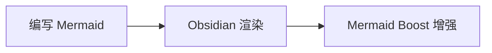

# Mermaid Boost (`mermaid-boost`)

简体中文 | [English](README.md)

Mermaid Boost 是一个用于 Obsidian 的 Mermaid 增强插件。它在不改变标准 Mermaid 代码块写法的前提下，为渲染后的图表加入智能紧凑缩放、**7 组共 29 种主题**、交互式缩放控制、全屏平移/缩放以及高清 PNG 导出等能力，让大型 Mermaid 图在 Obsidian 中更易阅读和使用。

- 当前版本：**1.0.1**
- 最低 Obsidian 版本：**1.5.0**
- 是否仅桌面端：**否**

## 功能特性

### 智能图表尺寸控制

Mermaid Boost 可以把较大的 Mermaid 图表压缩到更适合阅读的区域，同时设置最小可读缩放比例，避免为了塞进页面而把文字缩得过小。

内置 4 组尺寸预设：

| 预设 | 基础缩放 | 最大宽度 | 最大高度 | 最小可读缩放 |
| --- | ---: | ---: | ---: | ---: |
| Compact 紧凑 | 72% | 620 px | 320 px | 52% |
| Balanced 均衡 | 85% | 740 px | 440 px | 58% |
| Relaxed 宽松 | 100% | 900 px | 580 px | 65% |
| Original 原始 | 100% | 1600 px | 2400 px | 100% |

对于特别高的图表，插件可以优先自动折叠，而不是继续缩小到难以阅读。

### 交互控制

增强后的 Mermaid 图表会提供常用查看操作：

- 在图表工具栏中直接执行**缩小 / 重置 / 放大**。
- 比例徽标显示当前图表的实际显示缩放比例。
- **双击全屏**打开可平移、可缩放的交互式 Lightbox。
- 支持**高清 PNG 导出/复制**，便于粘贴到文档、报告或聊天工具中。
- 可在设置中调整缩放灵敏度。

### 7 组 29 种主题

主题不仅改变背景颜色，还会统一调整节点、分组、注释、连线、标签、字体、圆角和部分装饰效果。

#### 1. Styled 风格化（4）

- **`claude` — Claude：** 奶油色画布、陶土色强调、衬线字体。
- **`notion` — Notion：** 白底与柔和灰色，整体简洁克制。
- **`notion-dark` — Notion dark：** 深炭黑背景与浅色文字。
- **`handcrafted` — Handcrafted：** 纸张和马克笔质感，圆角节点与手绘抖动线条。

#### 2. Developer 开发者（4）

- **`nord` — Nord：** 冰蓝灰开发者配色。
- **`dracula` — Dracula：** 深紫底色与粉色强调。
- **`solarized` — Solarized：** 暖米色搭配青蓝色。
- **`gruvbox` — Gruvbox：** 复古、偏土色的深色主题。

#### 3. Paper & print 纸张与印刷（4）

- **`blueprint` — Blueprint：** 蓝底白线技术图风格，并带网格背景。
- **`newspaper` — Newspaper：** 类报纸纸张与油墨效果。
- **`academic` — Academic：** 克制的灰阶风格，适合论文、报告和学术场景。
- **`kraft-paper` — Kraft paper：** 牛皮纸底色和印刷感。

#### 4. Retro & playful 复古与趣味（5）

- **`chalkboard` — Chalkboard：** 绿板粉笔效果，并带手绘感。
- **`terminal-crt` — Terminal / CRT：** 荧光绿终端与 CRT 发光风格。
- **`game-boy` — Game Boy：** 四阶绿色复古掌机配色。
- **`synthwave` — Synthwave：** 霓虹粉紫配色与发光效果。
- **`sticky-notes` — Sticky notes：** 软木板感觉，搭配多色便利贴节点。

#### 5. Brand-inspired 品牌灵感（5）

- **`github-light` — GitHub light：** 白灰底色搭配绿色强调。
- **`github-dark` — GitHub dark：** GitHub 风格的低亮深色主题。
- **`linear` — Linear：** 近黑背景与紫色强调/发光。
- **`stripe` — Stripe：** 清爽白底与靛蓝配色。
- **`metro-map` — Metro map：** 粗线站点节点和地铁线路式多色路径。

#### 6. Functional 功能型（3）

- **`high-contrast` — High contrast：** 黑白高对比与更粗描边。
- **`colorblind-safe` — Colorblind-safe：** 使用 Okabe-Ito 风格安全配色。
- **`mono-accent` — Mono + one accent：** 灰阶基础配色，并用橙色突出关键路径。

#### 7. Built-in 内置 Mermaid（4）

- **`builtin-default` — default**
- **`builtin-neutral` — neutral**
- **`builtin-dark` — dark**
- **`builtin-forest` — forest**

## 设置项

可在 **Obsidian 设置 → Mermaid Boost** 中调整插件行为。

| 设置项 | 默认值 | 作用 |
| --- | --- | --- |
| Size preset | `compact` | 选择 Compact、Balanced、Relaxed 或 Original 尺寸方案。 |
| Base scale | `0.72` | 应用尺寸限制前的基础缩放比例。 |
| Max height | `320 px` | 图表在触发进一步缩放或折叠前的最大目标高度。 |
| Max width | `620 px` | 图表在触发缩放逻辑前的最大目标宽度。 |
| Min readable scale | `0.52` | 限制最小缩放比例，避免大图被缩得过小。 |
| Theme | `claude` | 从 29 个内置主题中选择一个。 |
| Node radius | `12` | 控制节点圆角。 |
| Multi-tone nodes | 关闭 | 在支持的主题中启用多层次节点色调。 |
| Trim pie padding | 开启 | 减少 Mermaid 饼图周围不必要的留白。 |
| Card frame | 开启 | 显示图表外围卡片/容器样式。 |
| Dot grid | 关闭 | 在图表卡片中显示可选点阵背景。 |
| Header bar | 开启 | 显示图表头部与工具栏区域。 |
| Auto-collapse tall diagrams | 开启 | 对过高图表自动折叠。 |
| Double-click fullscreen | 开启 | 双击图表时打开平移/缩放 Lightbox。 |
| Zoom sensitivity | `1.0` | 调整交互缩放灵敏度。 |

选择尺寸预设时，会自动得到一组合理的缩放参数；如果需要，也可以继续单独微调这些数值。

## 使用方法

在 Obsidian 笔记中正常使用 Mermaid 代码块即可：

````markdown

````

Obsidian 将 Mermaid 渲染为 SVG 后，Mermaid Boost 会继续应用当前的尺寸策略、主题、卡片外观与交互控件。原始 Mermaid 源码仍然是标准 Markdown，不需要专用语法。

## 安装

### 手动安装

1. 创建插件目录：

   ```text
   <Vault>/.obsidian/plugins/mermaid-boost/
   ```

2. 将仓库中的以下文件复制到该目录：

   - `manifest.json`
   - `main.js`
   - `styles.css`

3. 重新加载 Obsidian。
4. 打开 **设置 → 第三方插件 / Community plugins**。
5. 启用 **Mermaid Boost**。

> 当前 `manifest.json` 要求 Obsidian **1.5.0 或更高版本**，且插件未标记为仅桌面端。

## 兼容性说明

- Mermaid Boost 在 Obsidian 完成 Mermaid 渲染后再增强生成的 SVG，因此不要求任何自定义 Mermaid 语法。
- 主题系统会覆盖常见 Mermaid SVG 元素，例如节点、分组、注释、连线、标签和饼图颜色；不同图表类型，以及 Obsidian 内置 Mermaid 版本的变化，仍可能导致最终效果存在差异。
- 超大型图表会受当前尺寸预设约束。如果希望尽量接近原始 1:1 尺寸，可切换到 **Original**。

## 开发

仓库直接提交可运行的 JavaScript 文件，正常开发检查不依赖额外构建步骤。

CI 当前使用：

- Node.js **22**

运行测试：

```bash
npm test
```

执行 JavaScript 语法检查：

```bash
node --check main.js
node --check lib.js
node --check lib.test.js
```

仓库 CI 会在 Pull Request 以及推送到 `main` 时执行 JavaScript 语法检查、现有 Node 测试，以及基础的 Obsidian `manifest.json` / `package.json` 元数据校验。

## 仓库结构

| 路径 | 作用 |
| --- | --- |
| `main.js` | Obsidian 插件运行时代码、界面控件、设置页和图表增强逻辑。 |
| `lib.js` | 核心尺寸计算、主题配色与 SVG 美化逻辑。 |
| `lib.test.js` | 针对共享逻辑的 Node 测试。 |
| `styles.css` | 图表卡片、工具栏、Lightbox 与主题相关 CSS。 |
| `manifest.json` | Obsidian 插件元数据。 |
| `data.json` | 仓库中示例/当前插件设置数据。 |
| `.github/workflows/ci.yml` | 核心 CI 检查。 |
| `.coderabbit.yaml` | CodeRabbit 自动审查配置。 |

## 贡献

欢迎提交 Issue 和 Pull Request。涉及行为变化时，请同步更新文档与测试，并确认没有破坏现有 Mermaid 渲染、尺寸控制与交互体验。

## 许可证

当前 `package.json` 声明项目采用 **MIT** 许可证。
