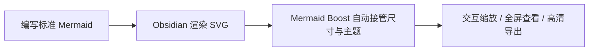

# Mermaid Boost

<div align="center">


<br />

[](https://github.com/dreamfarer-space/obsidian-mermaid-boost/releases/tag/1.0.1)
[](https://obsidian.md)
[](#7-%E5%A4%A7%E5%88%86%E7%BB%84-29-%E6%AC%BE%E4%B8%BB%E9%A2%98%E4%B8%80%E8%A7%88)
[](https://github.com/dreamfarer-space/obsidian-mermaid-boost/actions/workflows/ci.yml)
[](#%E8%B4%A1%E7%8C%AE%E4%B8%8E%E8%AE%B8%E5%8F%AF%E8%AF%81)

**[English](README.md)** · **简体中文**

[为什么选择 Mermaid Boost？](#%E4%B8%BA%E4%BB%80%E4%B9%88%E9%80%89%E6%8B%A9-mermaid-boost) · [核心特性](#%E6%A0%B8%E5%BF%83%E7%89%B9%E6%80%A7) · [29 款主题](#7-%E5%A4%A7%E5%88%86%E7%BB%84-29-%E6%AC%BE%E4%B8%BB%E9%A2%98%E4%B8%80%E8%A7%88) · [快速开始](#%E5%BF%AB%E9%80%9F%E5%BC%80%E5%A7%8B%E4%B8%8E%E5%AE%89%E8%A3%85) · [设置参考](#%E8%AE%BE%E7%BD%AE%E9%A1%B9%E5%8F%82%E8%80%83) · [本地开发](#%E6%9C%AC%E5%9C%B0%E5%BC%80%E5%8F%91)

</div>

---

## 为什么选择 Mermaid Boost？

在 Obsidian 中编写大型 Mermaid 流程图或架构图时，往往会遇到两大痛点：要么图表**撑破阅读区边缘**，要么被强行压缩成**字号极小、根本无法辨认的“蚂蚁字”**。

**Mermaid Boost** 在不改动任何原生 ` ```mermaid ` 语法的前提下，对 Obsidian 渲染后的 SVG 进行无损增强——引入**最小可读缩放下限（Readability Floor）**、**7 组 29 款精心调校的主题**、**工具栏内联缩放**、**双击全屏平移/缩放 Lightbox** 以及**一键高清 PNG 导出**。

| 能力维度 | Obsidian 原生 Mermaid | 使用 **Mermaid Boost** 增强后 |
| :--- | :--- | :--- |
| **大图尺寸控制** | 要么溢出容器，要么无下限缩小导致文字不可读 | **4 档尺寸预设（`S` / `M` / `L` / `1:1`）** + **最小可读比例保护下限** |
| **超长纵向流程图** | 强行拉长页面，打断正文阅读节奏 | **自动折叠超高图表**，优先保证字号可读而非无底线缩小 |
| **视觉与配色体系** | 单一默认样式，往往与笔记排版割裂 | **7 大分组共 29 款主题**（接管画布、节点、子图、连线、字体与 SVG 滤镜） |
| **交互与细节查看** | 静态 SVG，无法局部放大或拖拽 | **工具栏快捷缩放（`−` / `72%` / `+`）** + **双击全屏平移/滚轮缩放 Lightbox** |
| **导出与分享** | 只能手动截图，分辨率受屏幕限制 | **工具栏一键高清 PNG 导出/复制**，直接粘贴到论文、汇报与文档 |
| **Markdown 兼容性** | 标准 ` ```mermaid ` 代码块 | **100% 保持标准 ` ```mermaid ` 代码块**，零私有语法绑定 |

---

## 核心特性

### 1. 智能图表尺寸与可读性下限保护

Mermaid Boost 会将大型图表优雅地收敛到舒适的阅读宽度内，同时严格执行**最小可读缩放比例（Min Readable Scale）**。当图表纵向过高时，会自动触发折叠卡片而非把文字缩成一团。

| 尺寸预设 | 简称 | 基础缩放 | 最大宽度 | 最大高度 | 最小可读比例 | 适用场景 |
| :--- | :---: | ---: | ---: | ---: | ---: | :--- |
| **Compact 紧凑** *(默认)* | `S` | `72%` | `620 px` | `320 px` | **`52%`** | 高密度学习笔记、双栏分屏对照阅读 |
| **Balanced 均衡** | `M` | `85%` | `740 px` | `440 px` | **`58%`** | 日常技术笔记与项目文档 |
| **Relaxed 宽松** | `L` | `100%` | `900 px` | `580 px` | **`65%`** | 宽屏显示器与系统架构梳理 |
| **Original 原始** | `1:1` | `100%` | `1600 px` | `2400 px` | **`100%`** | 接近无约束的 1:1 原始比例展示 |

### 2. 交互式工具栏与全屏 Lightbox

每个增强后的 Mermaid 图表卡片顶部均配备即时交互栏：

- **工具栏内联缩放（`−` / `72%` / `+`）** — 随时微调当前图表比例，点击百分比徽标即可一键重置。
- **双击全屏 Lightbox** — 双击任意图表即可弹出全屏画布，支持鼠标滚轮无级缩放与按住拖拽平移。
- **一键高清 PNG 导出** — 直接将当前主题样式下的图表导出/复制为高分辨率 PNG 图像。
- **卡片与细节定制** — 支持独立开关卡片外框、建筑点阵背景（Dot Grid）、节点圆角以及饼图留白裁剪。

---

## 7 大分组 29 款主题一览

<div align="center">
  
</div>

<br />

每款主题都会深度接管 SVG 的 **画布底色、主次节点、Subgraph 分组、Note 注释、连线与箭头、标签底色、字体栈（衬线 / 无衬线 / 等宽 / 手写）、圆角半径以及专属 SVG 特效滤镜**（如手绘抖动线条、CRT 荧光发光、霓虹发光、蓝图网格与软木板纹理）。

| 主题分组 | 主题 ID | 名称 | 核心色板与字体 | 标志性视觉特征 |
| :--- | :--- | :--- | :--- | :--- |
| **1. Styled 风格化** *(4)* | `claude` *(默认)* | **Claude** | 奶油白 `#faf9f5` · 陶土色 `#c6613f` · 衬线体 | 温润人文书卷质感，大圆角节点与陶土色描边 |
| | `notion` | **Notion** | 纯白 `#ffffff` · 柔灰 `#f7f6f3` · 无衬线 | 干净克制的现代笔记风格，搭配暖黄注释块 |
| | `notion-dark` | **Notion dark** | 炭黑 `#191919` · 深灰 `#252525` · 无衬线 | 低眩光深色工作区配色 |
| | `handcrafted` | **Handcrafted** | 暖纸 `#fdf6e3` · 马克笔黄 `#fff3b0` · 手写体 | 纸张手账质感，启用 SVG `wobble` 手绘抖动滤镜 |
| **2. Developer 开发者** *(4)* | `nord` | **Nord** | 极夜蓝灰 `#2e3440` · 冰晶蓝 `#88c0d0` · 无衬线 | 经典北极冷色调开发者配色 |
| | `dracula` | **Dracula** | 暗紫灰 `#282a36` · 紫罗兰 `#bd93f9` · 霓虹粉 `#ff79c6` | 高辨识度暗黑主题，粉色高亮连线 |
| | `solarized` | **Solarized** | 暖米色 `#fdf6e3` · 青蓝 `#268bd2` · 无衬线 | 经典护眼暖色科学色板 |
| | `gruvbox` | **Gruvbox** | 复古深褐 `#282828` · 琥珀黄 `#fabd2f` · 无衬线 | 温暖厚重的复古终端暗色系 |
| **3. Paper & Print 纸张与印刷** *(4)* | `blueprint` | **Blueprint** | 工程蓝 `#0b3d91` · 纯白线条 `#ffffff` · 等宽体 | 20px 双轴工程制图网格背景与白线蓝图质感 |
| | `newspaper` | **Newspaper** | 新闻纸 `#f2efe8` · 铅印黑 `#111111` · 衬线体 | 经典报刊油墨印刷排版质感 |
| | `academic` | **Academic** | 纯白 `#ffffff` · 严谨灰阶 `#333333` · 学术衬线 | Computer Modern / Times 风格，专为论文与报告设计 |
| | `kraft-paper` | **Kraft paper** | 牛皮纸 `#c9a97a` · 浓咖 `#4a3520` · 等宽体 | 复古牛皮纸张与印章墨色风格 |
| **4. Retro & Playful 复古与趣味** *(5)* | `chalkboard` | **Chalkboard** | 黑板绿 `#2f3e37` · 粉笔白 `#f5f5f0` · 手写体 | 课堂绿黑板与粉笔手绘抖动线条 |
| | `terminal-crt` | **Terminal / CRT** | 显像管黑 `#050805` · 荧光绿 `#33ff66` · 等宽体 | 复古绿屏终端，内置荧光 `glow` 发光滤镜 |
| | `game-boy` | **Game Boy** | 橄榄绿 `#9bbc0f` · 深林绿 `#0f380f` · 等宽体 | 经典四阶绿色复古掌机液晶屏配色 |
| | `synthwave` | **Synthwave** | 午夜紫 `#1a0b2e` · 霓虹粉 `#ff2e97` · 电光青 `#00f0ff` | 80 年代合成器浪潮，粉色发光描边与青色激光连线 |
| | `sticky-notes` | **Sticky notes** | 软木板 `#c89f6b` · 多色便利贴循环 · 手写体 | 软木纹理背景，黄/粉/薄荷绿多色便利贴节点 |
| **5. Brand-Inspired 品牌灵感** *(5)* | `github-light` | **GitHub light** | 纯白 `#ffffff` · 浅灰 `#f6f8fa` · 绿 `#1a7f37` | GitHub Primer 浅色文档风格 |
| | `github-dark` | **GitHub dark** | 暗夜蓝黑 `#0d1117` · 绿 `#238636` | GitHub Primer 深色模式配色 |
| | `linear` | **Linear** | 曜石黑 `#0b0b0f` · 靛紫 `#5e6ad2` · 无衬线 | 极简近黑界面与柔和紫光描边 |
| | `stripe` | **Stripe** | 纯白 `#ffffff` · 靛蓝 `#635bff` · 青 `#00d4ff` | 现代金融科技文档清爽蓝紫风 |
| | `metro-map` | **Metro map** | 纯白 `#ffffff` · 粗框站点 `#111111` · 多色干线 | 4px 站点节点与 6px 红/蓝/绿循环地铁线路 |
| **6. Functional 功能型** *(3)* | `high-contrast` | **High contrast** | 纯白 `#ffffff` · 纯黑 `#000000` · 亮黄 `#ffff00` | 3px 加粗描边，最大化对比度与投屏清晰度 |
| | `colorblind-safe` | **Colorblind-safe** | 纯白 `#ffffff` · Okabe-Ito 6 色安全循环 | 基于无障碍视觉研究的色盲友好多色分类节点 |
| | `mono-accent` | **Mono + one accent** | 锌灰 `#f4f4f5` · 信号橙 `#e8590c` | 克制的灰阶底座，仅用高饱和橙色聚焦核心路径 |
| **7. Built-in 内置原生** *(4)* | `builtin-default` | **default** | 经典淡紫 `#ECECFF` · 描边 `#9370DB` | Mermaid 原生默认配色 + Boost 尺寸与交互增强 |
| | `builtin-neutral` | **neutral** | 中性灰 `#f4f4f4` · 描边 `#666666` | Mermaid 原生中性灰阶配色 |
| | `builtin-dark` | **dark** | 深炭灰 `#1f2020` · 钢蓝 `#81B1DB` | Mermaid 原生深色配色 |
| | `builtin-forest` | **forest** | 森林绿 `#cde498` · 松绿 `#13540c` | Mermaid 原生森林绿配色 |

---

## 快速开始与安装

### 方式一：通过 GitHub Release 或 BRAT 安装

- **从 [GitHub Releases (`v1.0.1`)](https://github.com/dreamfarer-space/obsidian-mermaid-boost/releases/tag/1.0.1) 下载**：下载 `mermaid-boost-1.0.1.zip` 并将其中的文件解压到 `<Vault>/.obsidian/plugins/mermaid-boost/`，或单独下载 `manifest.json`、`main.js`、`styles.css` 并复制到该目录。
- **通过 [Obsidian BRAT](https://github.com/TfTHacker/obsidian42-brat) 安装**：在 BRAT 中添加测试插件仓库 `dreamfarer-space/obsidian-mermaid-boost` 并启用 **Mermaid Boost**。

### 方式二：手动安装

1. 在你的 Obsidian 知识库（Vault）下创建插件目录：
   ```text
   <Vault>/.obsidian/plugins/mermaid-boost/
   ```
2. 将本仓库中的以下 3 个核心文件复制到该目录中：
   - `manifest.json`
   - `main.js`
   - `styles.css`
3. 重新加载 Obsidian（`Ctrl/Cmd + R`）。
4. 打开 **设置 → 第三方插件（Community plugins）**，启用 **Mermaid Boost**。

> [!NOTE]
> 插件要求 **Obsidian 1.5.0 及以上版本**，同时支持桌面端与移动端（`isDesktopOnly: false`）。

### 使用方式

在笔记中直接使用标准 Mermaid 代码块即可，无需任何特殊语法：

````markdown

````

---

## 设置项参考

可在 **Obsidian 设置 → Mermaid Boost** 中灵活配置所有参数：

| 分类 | 设置项 | 默认值 | 说明 |
| :--- | :--- | :---: | :--- |
| **尺寸控制** | **Size preset** | `compact` | 一键切换 `compact`（`S`）、`balanced`（`M`）、`relaxed`（`L`）或 `original`（`1:1`）。 |
| | **Base scale** | `0.72` | 应用最大宽高约束前的默认基础缩放比例。 |
| | **Max width** | `620 px` | 图表触发等比缩放前的目标最大宽度。 |
| | **Max height** | `320 px` | 图表触发缩放或自动折叠前的目标最大高度。 |
| | **Min readable scale** | `0.52` | 最小可读缩放下限，防止巨型图表被缩成无法辨认的小字。 |
| | **Auto-collapse tall diagrams** | `开启` | 对超高图表自动启用折叠面板。 |
| **外观与主题** | **Theme** | `claude` | 从 7 大分组共 29 款内置主题中任选其一。 |
| | **Node radius** | `12` | 控制流程图节点的圆角半径。 |
| | **Multi-tone nodes** | `关闭` | 在支持多色调的主题中开启主次节点色彩交替。 |
| | **Trim pie padding** | `开启` | 自动裁剪 Mermaid `pie` 饼图四周的多余留白。 |
| **卡片与界面** | **Card frame** | `开启` | 为图表包裹带主题配色的精致外框卡片。 |
| | **Dot grid** | `关闭` | 在卡片画布中叠加可选的工程点阵背景。 |
| | **Header bar** | `开启` | 显示顶部工具栏（含缩放按钮、比例徽标与高清 PNG 导出）。 |
| **交互体验** | **Double-click fullscreen** | `开启` | 双击图表任意位置打开支持拖拽平移与滚轮缩放的 Lightbox。 |
| | **Zoom sensitivity** | `1.0` | 调节交互缩放的步进灵敏度。 |

---

## 本地开发

本仓库直接提供零构建步骤的运行时 JavaScript 代码，便于直接阅读、测试与二次开发。

```bash
# 运行 Node 单元测试套件（需 Node.js 22+）
npm test

# 运行 JavaScript 语法检查
node --check main.js
node --check lib.js
node --check lib.test.js
```

### 仓库目录结构

| 路径 | 职责说明 |
| :--- | :--- |
| `main.js` | Obsidian 插件生命周期、DOM 监听、工具栏控件、全屏 Lightbox、高清 PNG 导出与设置页 |
| `lib.js` | 核心尺寸计算引擎（`SIZE_PRESETS`）、29 款主题色板（`THEMES`）与 SVG 美化纯函数 |
| `lib.test.js` | 基于 Node 的自动化测试套件，覆盖尺寸计算、主题完整性与 SVG 转换 |
| `styles.css` | 图表卡片、工具栏按钮、全屏 Lightbox 弹窗与主题相关样式 |
| `manifest.json` | Obsidian 插件清单元数据（`1.0.1`，`minAppVersion: 1.5.0`） |
| `assets/` | 文档顶部 Hero 横幅与 29 款主题全景预览 SVG 资源 |

---

## 贡献与许可证

欢迎提交 Issue 与 Pull Request！如果修改了 `lib.js` 中的尺寸计算或主题定义，请在提交前运行 `npm test` 确保测试全部通过。

本项目基于 **[MIT License](LICENSE)** 开源。
